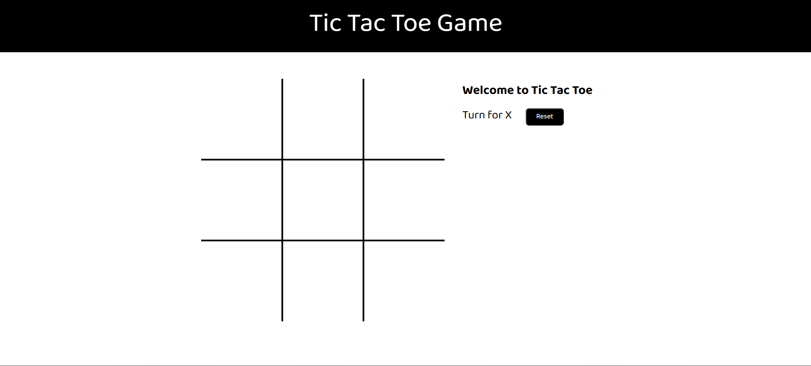

# Tic Tac Toe Game - HTML, CSS, and JavaScript

A simple Tic Tac Toe game built with HTML, CSS, and JavaScript, where two players can compete in a fun and interactive game directly in the browser.

## Features
- Two-player gameplay
- Game reset option
- Simple, interactive UI

## Screenshot

## Technologies Used
 HTML  
 CSS  
 JavaScript  

## Installation

1. Clone the repository or download the files.
2. Open the `index.html` file in your browser to start playing.

